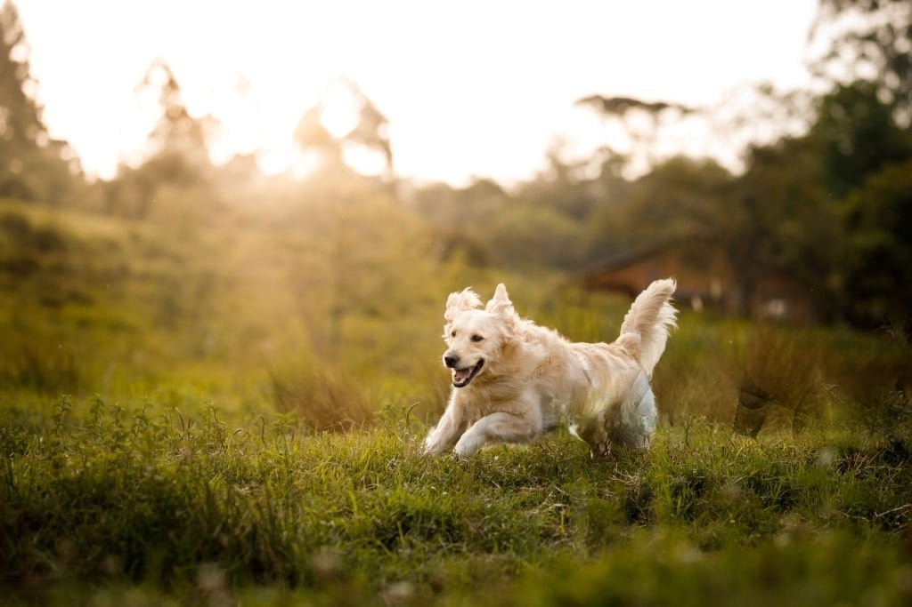

# 📷 Image Captioning System [](https://www.djangoproject.com/) [](https://www.tensorflow.org/)

A deep learning system that generates descriptive captions for images using ResNet50 + LSTM architecture.


  
*Generated Caption: "a light brown dog is running through a grassy field."*

## 🚀 Key Features
- **Hybrid Architecture**: ResNet50 (CNN) for image features + LSTM for sequence modeling
- **Batch Processing**: Efficient feature extraction (64 images/batch)
- **Text Processing**: 
  - Custom tokenization with start/end sequence markers
  - Dynamic padding up to 82 tokens
- **GPU Acceleration**: Automatic GPU detection & utilization
- **Model Preservation**: 
  - Keras model checkpointing 
  - Tokenizer serialization

## 🧠 Model Architecture
```python
# Feature extractor (ResNet50)
inputs1 = Input(shape=(2048,))
fe1 = Dropout(0.5)(inputs1)
fe2 = Dense(256, activation='relu')(fe1)

# Sequence model (LSTM)
inputs2 = Input(shape=(max_length,))
se1 = Embedding(vocab_size, 256, mask_zero=True)(inputs2)
se2 = Dropout(0.5)(se1)
se3 = LSTM(256)(se2)

# Combined decoder
decoder1 = add([fe2, se3])
decoder2 = Dense(256, activation='relu')(decoder1)
outputs = Dense(vocab_size, activation='softmax')(decoder2)
```

## 🛠️ Training Details
- **Dataset**: Flickr30K (31,000 images with 5 captions each)
- **Validation**: 80/20 train-test split
- **Optimization**:
  - Early stopping (patience=6)
  - Adam optimizer
  - Categorical crossentropy loss
- **Hardware**: Automatic GPU fallback to CPU

## 📥 Getting Started
1. **Dataset Setup**
```bash
mkdir -p flickr30k/Images
wget http://example.com/flickr30k.zip && unzip flickr30k.zip
```

2. **Install Dependencies**
```bash
pip install -r requirements.txt
```

3. **Directory Structure**
```
├── flickr30k/
│   ├── Images/
│   └── captions.txt
├── testing/
│   ├── image_captioning_model_finalv2.keras
│   └── tokenizerfinalv2.pkl
└── train&test.ipynb
```

## 🧪 Usage Example
```python
from caption_generator import generate_caption

# Initialize with pretrained models
generator = CaptionGenerator(
    model_path='testing/image_captioning_model_finalv2.keras',
    tokenizer_path='testing/tokenizerfinalv2.pkl'
)

# Generate caption for new image
caption = generator.predict('dogggy.jpeg')
print(f"Generated: {caption}")
```

## 📊 Results
| Metric          | Training | Validation |
|-----------------|----------|------------|
| Loss            | 2.14     | 2.67       |
| Caption Length  | 82       | 82         |
| Vocabulary Size | 8,761    | 8,761      |

## 🔧 Technologies
- **Core Framework**: TensorFlow 2.17.0
- **Keras**: 3.4.1
- **Image Processing**: Pillow 10.4.0
- **NLP**: NLTK 3.8.1

## 📚 Python Libraries
```python
import tensorflow as tf
import pandas as pd
import nltk
from tensorflow.keras.layers import LSTM, Embedding, Dense
from tensorflow.keras.applications import ResNet50
```

## 📜 License
MIT License - See [LICENSE](LICENSE) for details

**Maintainer**: Nipun Bakshi
*Trained on NVIDIA GeForce RTX 3060*  
*Total training time: ~7 hours*
